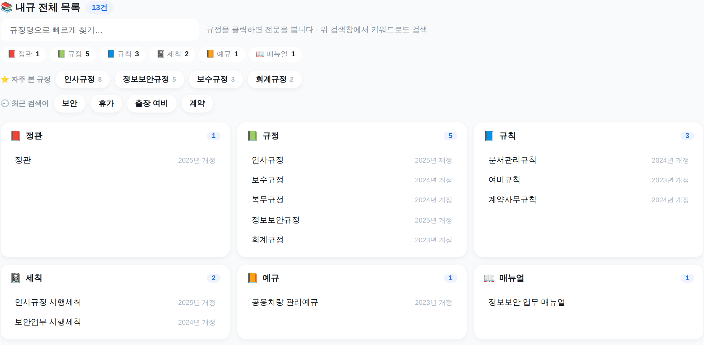
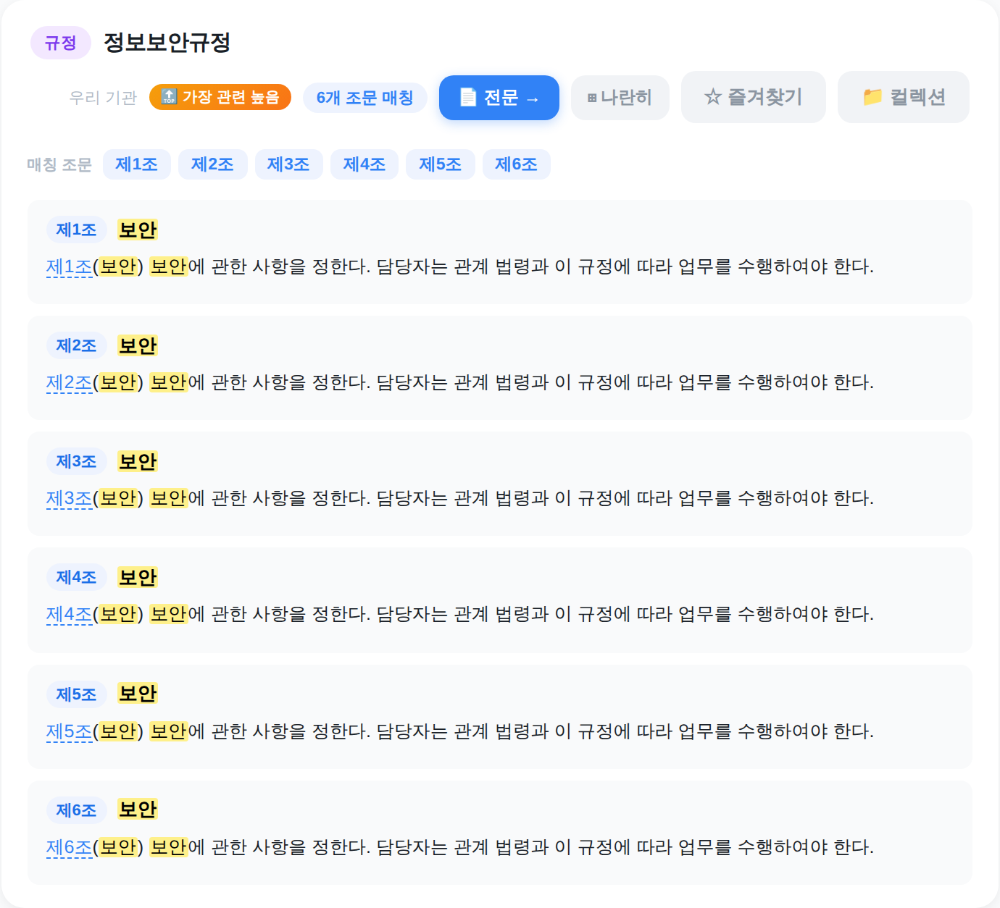

<div align="center">

# 📚 기관 내규 · 국가법령 종합 검색

**우리 기관의 내규(사규)와 국가법령을 한 화면에서 검색하고, 서로 연결해 열람하는 웹서비스 템플릿**

<em>org-legal-search — 기관 종속 데이터·브랜딩을 제거한 범용 구조. 다른 기관도 그대로 가져다 쓸 수 있습니다.</em>

<sub>Flask · Vanilla JS SPA · 법제처(law.go.kr) OpenAPI · Vercel 배포 · 의미 검색(임베딩) · 시나리오 AI</sub>

<br/>



</div>

---

## ✨ 주요 기능

| | 기능 | 설명 |
|:--:|---|---|
| 🔎 | **내규 검색** | 규정을 조문 단위로 검색·미리보기. 결과 요약 헤더 · 관련도 순위 · 분류 필터 제공 |
| 📚 | **분류 대시보드** | 검색 전, 전체 내규를 정관·규정·규칙·세칙·예규·매뉴얼로 정리. 자주 본 규정·최근 검색어 빠른 접근 |
| ⚖️ | **국가법령 연계** | 법제처 OpenAPI로 법령 본문·조문·개정이력을 실시간 조회 |
| 🔗 | **내규 ↔ 법령 상호참조** | 내규 본문의 「법령명」·「제N조」를 자동 링크. 법령 화면에서 관련 내규 교차 표시 |
| 🧠 | **의미(임베딩) 검색** | 키워드가 달라도 뜻이 가까운 조문을 함께 노출 <sub>(선택 · 벡터 생성 시)</sub> |
| 💬 | **실무 시나리오 AI** | 업무 상황을 질문하면 근거 법령·조문을 제안 <sub>(Gemini/Claude/GPT · 선택)</sub> |
| 🪟 | **나란히 열람** | 내규·법령을 한 화면 그리드에서 비교. 즐겨찾기·컬렉션 저장 |
| 📤 | **개정 내규 업로드** | 개정본을 올려 배포에 반영 <sub>(토큰 보호 · 선택)</sub> |

---

## 🖥️ 화면 구성

### ① 내규 전체 목록 대시보드 (검색 전 랜딩)
전체 내규를 분류별로 한눈에. 상단 pill로 분류 필터, 규정명 즉시 검색, 자주 본 규정·최근 검색어 바로가기.

<div align="center"></div>

### ② 검색 결과 요약 헤더
검색 즉시 **규정 수 · 매칭 조문 수 · 분류 분포 · 최상위 관련 규정**을 요약해 한눈에 파악.

<div align="center"></div>

### ③ 규정 카드 · 조문 매칭
규정별 카드에 관련도 순위(`🔝 가장 관련 높음`), **매칭 조문 빠른 이동 칩**, 키워드 하이라이트, 전문/나란히/즐겨찾기 액션.

<div align="center"></div>

---

## 🚀 빠른 시작

```bash
# 1) 템플릿 복사
cp -r templates/ ../my-org-legal-search && cd ../my-org-legal-search

# 2) 바꿀 지점 찾기 (코드 곳곳의 [기관 설정] 주석)
grep -rn "\[기관 설정\]" .

# 3) 환경변수 준비 — LAW_OC(법제처 OC 키) 등 채우기
cp .env.example .env

# 4) 실행
pip install -r requirements.txt
python run_local.py            # http://localhost:5100
```

> `LAW_OC`(법제처 OpenAPI OC 키)가 있어야 국가법령 조회가 동작합니다.
> 시나리오 AI·의미 검색은 해당 키가 있을 때만 켜지고, 없어도 나머지 기능은 동작합니다.

---

## 🏢 우리 기관에 맞게 (커스터마이즈)

코드의 `[기관 설정]` 주석 지점만 바꾸면 됩니다. 상세는 [`reference/customization.md`](reference/customization.md).

**`index.html` (프론트)**
- 제목 · 로고(`ORG`) · 브랜드 문구 · 푸터 기관명
- `DEFAULT_AGENCIES` / `DEFAULT_KEYWORDS` / `AGENCY_PROFILES` — 국가법령 소관기관 탭·추천 키워드
- `INTERNAL_CATEGORIES` — 내규 검색 바로가기 칩 · `guessOrg()` — 법령명→소관부처 추정

**`api_server.py` (백엔드)**
- `LAW_OC`(환경변수) · CORS 도메인 · `SAGYU_MCP_URL`(내규 MCP, 선택)
- `DOMAIN_LAW_MAP` / `CANDIDATE_LAWS` / `AVAILABLE_LAWS` — 소관 법령 목록
- 시나리오 AI 시스템 프롬프트의 기관명

---

## 📂 데이터 준비

내규는 **매니페스트 + 규정 HTML** 두 가지로 넣습니다. 형식 상세: [`reference/data-format.md`](reference/data-format.md).

**`regulations_manifest.json`** — 규정 목록(대시보드·필터의 원천)
```json
[
  {
    "title": "정보보안규정",
    "revision": "2025년 3월 일부개정",
    "category": "규정",
    "slug": "정보보안규정",
    "html": "/regulations/정보보안규정/index.html"
  }
]
```

**`regulations/<규정명>/index.html`** — 규정 본문(HWP/HWPX → HTML 변환).
백엔드가 텍스트를 추출해 `제N조(제목) 내용` 형태의 조문 단위로 검색·표시합니다.

> 템플릿에는 형식 확인용 **샘플 규정 2건**(인사규정·정보보안규정)이 들어 있습니다.
> 실제 배포 시 우리 기관 내규로 교체하세요. (선택) `python scripts/build_embeddings.py`
> 로 의미 검색 벡터를 생성할 수 있습니다.

---

## ☁️ 배포 (Vercel)

구조가 이미 Vercel에 맞춰져 있습니다(`vercel.json`, `api/index.py`).

1. `templates/` 내용을 배포용 리포 루트로 두고 Vercel 프로젝트에 연결
2. 환경변수 등록: `LAW_OC`, (선택) `GEMINI_API_KEY`·`SAGYU_MCP_URL`·`REG_UPLOAD_TOKEN` 등
3. 배포 — `/api/*`는 Flask, `/regulations/*`·`/`는 정적으로 서빙(보안 헤더·CSP 포함)

자세한 절차: [`reference/deployment.md`](reference/deployment.md)

---

## 📚 문서

| 문서 | 내용 |
|---|---|
| [`SKILL.md`](SKILL.md) | 스킬 개요 · 세팅 순서 · 커스터마이즈 체크리스트 |
| [`reference/architecture.md`](reference/architecture.md) | 데이터 흐름 · API 계약 · 검색 관련도 모델 |
| [`reference/data-format.md`](reference/data-format.md) | 매니페스트 · 규정 HTML · 임베딩 벡터 스키마 |
| [`reference/customization.md`](reference/customization.md) | 기관별 치환 지점 상세 |
| [`reference/deployment.md`](reference/deployment.md) | 로컬 실행 · Vercel 배포 · 환경변수 |

---

## ⚠️ 주의

- **비밀정보 금지** — 실제 `.env`(키 포함)는 커밋하지 마세요. `.env.example`만 공유합니다.
- **자산 존중** — 다른 기관의 내규·임베딩을 그대로 재배포하지 마세요. 각 기관은 자기 내규로 채웁니다.
- 국가법령 원문은 법제처 OpenAPI로 실시간 조회하며 별도 저장하지 않습니다.
- 위 화면은 범용 템플릿을 샘플 데이터로 구동한 예시입니다(브랜드·데이터는 기관에 맞게 교체).
